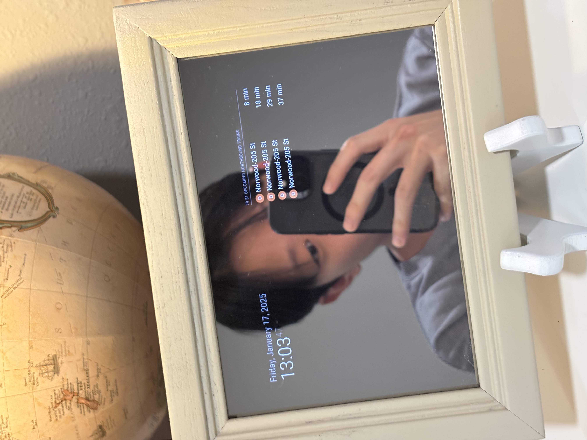

# MMM-MTATrainTimes

Displays upcoming train times for a given MTA station.


### Installing the module
Clone this repository in your Magic Mirror project under `~/MagicMirror/modules/`.
```
git clone https://github.com/LwrncLiu/MMM-MTATrainTimes.git
```

In the `MMM-MTATrainTimes/` directory that you just cloned, run the command below to install the necessary node packages for this module.
```
npm install
``` 

### Using the module
Add the module to the `~/MagicMirror/config/config.js` file under modules:
```
modules: [
    {
        ...
    },
    {
        module: "MMM-MTATrainTimes",
        position: "top_right",
        config: {
            stopId: "R31",
            routeIds: ["D", "N"],
            northBound: true,
            southBound: false,
            numTrains: 10,
            }
    }
]
```

### Configuration Options

| config | type | description | 
| --- | --- | --- | 
| `stopId` | String | The stop id of the station the module will display train times for. See the `parentStops` map in `node_helper.js` for the list of available stops. Some stations with more than one platform can have multiple id values. |
| `routeIds` | Array[String] | Filters trains by train line. All trains lines arriving at the station will be shown if this parameter is not set or an empty list. |
| `northBound` | Boolean | The module will display north bound trains if set to true. |
| `southBound` | Boolean | The module will display south bound trains if set to true. |
| `numTrains` | Number | The maximum number of trains to be displayed at once. |

<em>In the example configuration, the module will display the next 10 northbound D and N trains arriving at Atlantic Av-Barclays Ctr.</em>

## Aside

I built this module as a personal coding challenge to complement my magic mirror, which I constructed using a 5" x 7" picture frame, 7" monitor, Raspberry Pi 3, two-way acrylic mirror, some spray paint, and some electrical tape. It provides real-time train arrival times at a glance, so I don’t have to check my phone.

<p align="center">

</p>