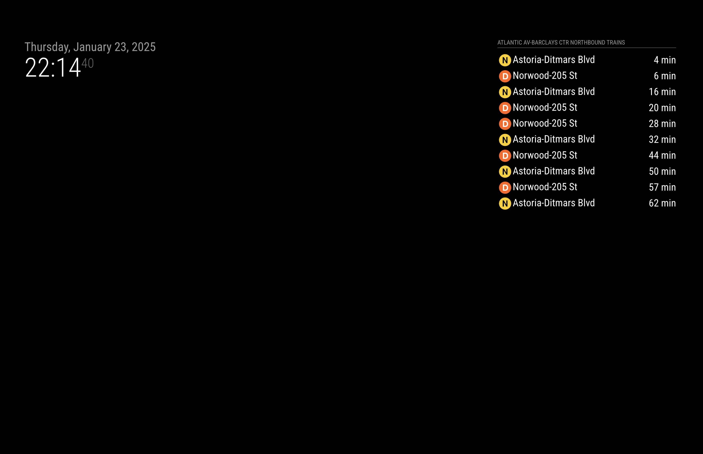

# MMM-MTATrainTimes

Displays upcoming train times for a specific MTA station. DISCLAIMER: this module is currently only compatible with the D-line. TODO: make it extensible to all train lines.



### Installing the module
Clone this repository in your Magic Mirror project under `~/MagicMirror/modules/`.
```
git clone https://github.com/LwrncLiu/MMM-MTATrainTimes.git
```

In the `MMM-MTATrainTimes/` directory that you just cloned, run the command below to install the necessary node packages for this module.
```
npm install
``` 

### Using the module
Add the module to the `~/MagicMirror/config/config.js` file under modules:
```
modules: [
    {
        ...
    },
	{
	    module: "MMM-MTATrainTimes",
		position: "top_right",
		config: {
		    stopId: "B18",
			northBound: true,
            southBound: false
		}
	}
]
```

### Configuration Options
| config | description | 
| --- | --- |
| `stopId` | The stopId the module will display train times for. See `stopNameMap` in `node_helper.js` for the list of available stops. |
| `northBound` | The module will display north bound trains if set to true. |
| `southBound` | The module will display south bound trains if set to true. |